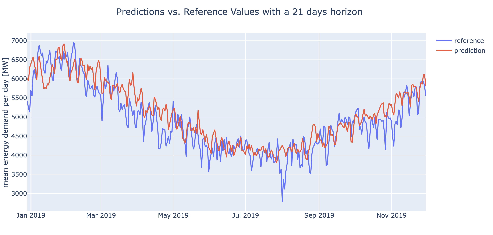
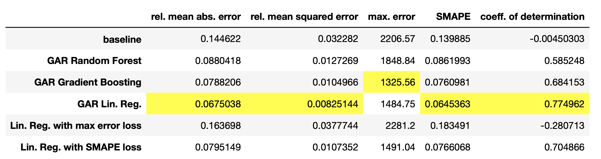

# Energy Demand Prediction in Switzerland with giotto-time

## What is it?
This repository contains the code for the blog post 'Energy Demand Prediction in Switzerland with giotto-time' [LINK HERE] where we use the Python time series library giotto-time [https://github.com/giotto-ai/giotto-time] to predict the mean daily energy demand (in megawatts) in Switzerland 21 days ahead using generalized autoregression models and linear regression with custom loss functions, both of which are provided by giotto-time. 

The 
'energy_demand_time_series.ipynb' showcases the most important functionalities of giotto-time and how to use them to:
* remove trends and deal with seasonalities
* make a causality test and thereby find the ideal shift between one time series and another to make predictions.
* easily create a range of different features
* use generalized autoregression models and linear regression with custom loss functions to make predictions using the 'fit/predict' methods.

## Getting started
You want to start right away? The easiest way to get started is to create a conda environment as follows:
```
conda create python=3.7 --name time -y
conda activate time
pip install -r requirements.txt
```
Then the notebook 'energy_demand_time_series.ipynb' will walk you through the analysis and the prediction steps.

## Results
In this section we present the results. The figure below shows the reference values as well as the predictions for one of the models shown in the notebook. 




An important point for this tutorial is to show different models giotto-time has to offer. In the table below we list the results for different models and with different metrics.


